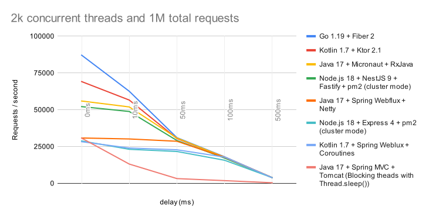

## Benchmark Rest Frameworks

The purpose of this project is to run benchmarks on the different versions of a microservice and see what happens with 
the throughput (request/seconds) for each case. 
This project contains different versions of a microservice that exposes a GET endpoint which receives a query parameter
which named "delay" and returns an empty string with status 200 after that "delay" time measured in milliseconds. 
By no means is this project intended to determine which technology is better. Actually, this project aims just to grasp 
an idea about how do these technologies compare to each other in proposed specific scenarios.

## Example of how run a request with curl
curl --location --request GET 'http://localhost:3000/v1/benchmark?delay=1000'
This will respond after 1 second with status 200.

## Why adding a delay to the response?
Generally, microservices depend on other software components, they may connect to a database or make
a http call to other services or read a file. These kind of operations take time to complete, so the idea is to simulate 
these scenarios in the simplest way.

## Benchmark Tool
I decided to use jmeter to measure the throughput. 
The script can be found in jmeter.jmx file

## Machine on which the tests were run
- CPU AMD Ryzen™ 5 3600
- 16gb RAM
- Windows 10
- JDK 17 (GraalVM 17.0.5)

## Results
| Technology                                                          | 0ms   | 10ms  | 50ms  | 100ms | 500ms |
|---------------------------------------------------------------------| ----- | ----- | ----- | ----- | ----- |
| Go 1.19 + Fiber 2                                                   | 87100 | 62578 | 31068 | 18044 | 3874  |
| Kotlin 1.7 + Ktor 2.1                                               | 69156 | 56600 | 30454 | 17782 | 3881  |
| Java 17 + Micronaut 3 + RxJava 3                                    | 55950 | 51934 | 30794 | 17771 | 3901  |
| Node.js 18 + NestJS 9 + Fastify + pm2 (cluster mode)                | 52148 | 48832 | 29129 | 17190 | 3883  |
| Java 17 + Spring Webflux + Netty                                    | 30811 | 30165 | 28605 | 17703 | 3892  |
| Node.js 18 + Express 4 + pm2 (cluster mode)                         | 28800 | 23133 | 21648 | 15700 | 3881  |
| Kotlin 1.7 + Spring Weblux + Coroutines                             | 28285 | 23987 | 22816 | 17831 | 3866  |
| Java 17 + Spring MVC + Tomcat (Blocking theads with Thread.sleep()) | 30722 | 13097 | 3230  | 1838  | 393   |

* Value on each cell represents throughput (requests/second)
* Delay is measured in milliseconds

## Conclusion
When delay value was not supplied, Go + Fiber seems to have the best throughput of all tested frameworks.
However, all options tend to converge to a similar throughput when tested with higher delay times.
The option with Java 17 + Spring MVC was the only one that blocked threads, and it was by far the worst performance of all.
Using Kotlin with Spring seems to result in a slight decrease on throughput compared to the Java option that makes use of reactive programing and spring webflux.
Nevertheless, Ktor framework, which is the official Kotlin framework made by Jetbrains, seems to offer better throughput than Spring.
All these technologies have pros and cons and I wouldn't say there is a clear winner just based on these results. Furthermore,
there are multiple additional things to consider when choosing a technology and this should be taken with a grain of salt.